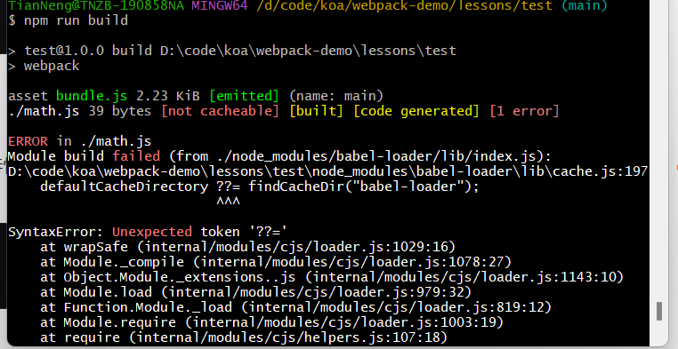

这个错误是由于你的 Node.js 版本不支持空值合并赋值运算符（??=），这是 ECMAScript 2021（ES12）引入的特性。以下是解决此问题的几种方法：

1. 更新 Node.js 版本：确保你使用的 Node.js 版本支持最新的 JavaScript 特性。
2. 降级 Babel Loader：可以考虑降级 babel-loader 到一个不使用该特性的版本，目前是 "babel-loader": "^10.0.0"

```
npm install babel-loader@8 --save-dev
```

3.
