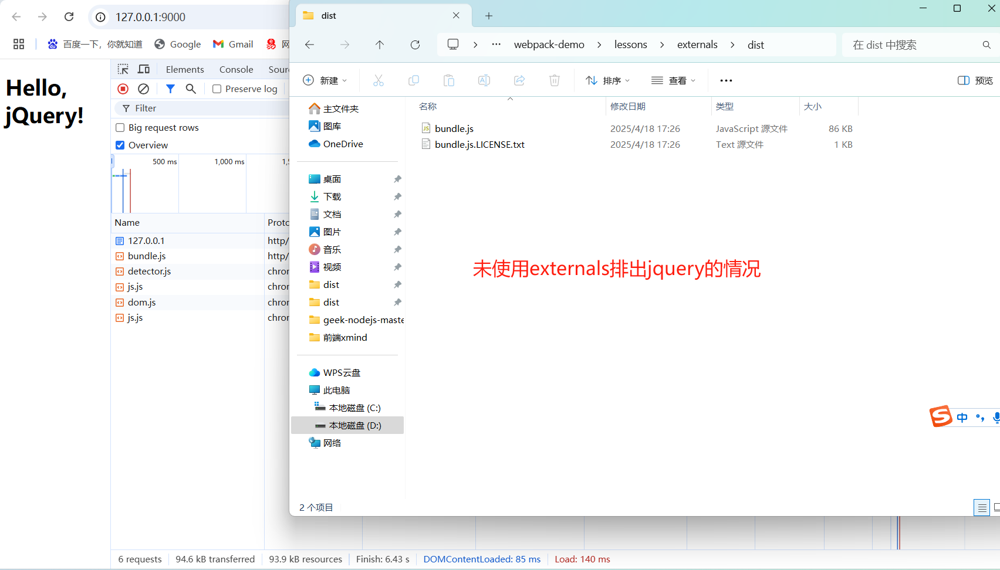
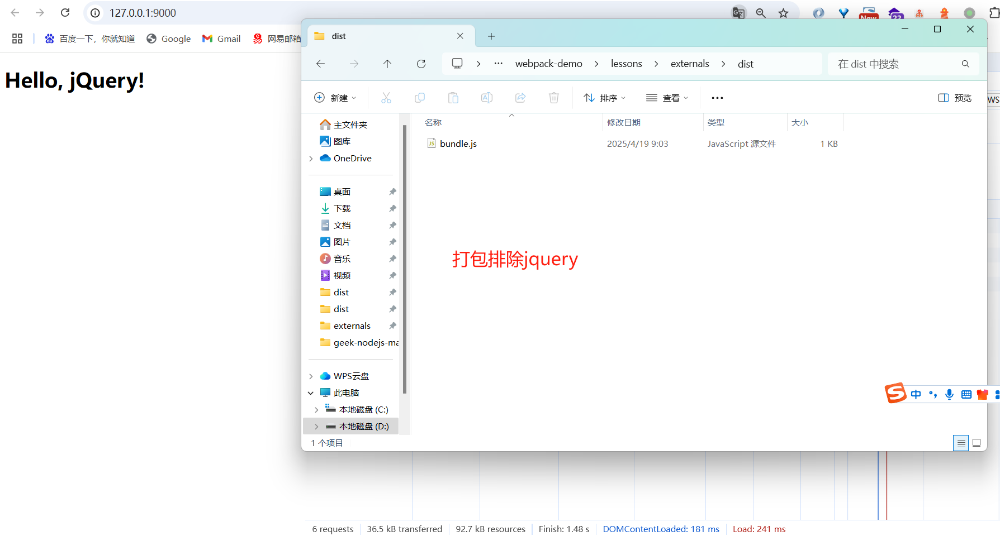

# externals

从输出的 bundle 中排出依赖。防止将依赖打包进 bundle 中，而是在运行时(runtime)从外部获取这些扩展依赖。
例如，从 CDN 引入 jQuery，而不是把它打包：

```js
externals: {
  jquery: "jQuery";
}
```

```js
import $ from "jquery";
```

```html
<script src="https://code.jquery.com/jquery-3.1.1.min.js"></script>
```

## 使用场景

- 需要动态加载的依赖
- 需要避免将某些依赖打包进 bundle 中，而是通过 CDN 引入
- 需要避免将某些依赖打包进 bundle 中，而是通过 npm 安装
- 需要避免将某些依赖打包进 bundle 中，而是通过其他方式引入

## 注意事项

- 使用 externals 时，需要确保在运行时(runtime)能够正确地获取到这些依赖
- 使用 externals 时，需要确保这些依赖的版本和你的项目中的版本兼容
- 使用 externals 时，需要确保这些依赖的加载顺序和你的项目中的加

# 测试

## 排除 jquery

- 这里我们把 jquery 从 bundle 中排除，在 html 中通过 cdn 引入，因为入口文件是 ESM 模块，所以 webpack.config.js 设置了 esModuleInterop，这样就可以使用 import 语法了。
- 我们打包后的输出文件也就是 ESM,在这里使用了 html 文件测试，因此需要修改 package.json 的 type 为 module，这样就可以使用 ESM 模块了。\
- html 文件需要使用静态服务器启动，因为 ESM 模块需要通过静态服务器来加载。
- script 引用打包后的文件，因为打包后的文件是 ESM 模块，所以需要使用 type="module"。
- 打包的时候由于我们配置文件使用的是 CommonJS 模块，所以需要去掉 package.json 中的 type: "module"设置
- 这里不需要 install jquery,因为我们是排除 jquery 的。
- 同时，因为通过全局变量的方式使用 jquery,源码中 import 或者 require 模块的代码修需要删掉,否则会报错。因为我们此时不需要通过模块来使用 jquery,而是通过全局变量来使用 jquery。
- 此时要是保留 import 和 require 模块的代码，打包的时候会报错，因为打包后的文件会包含 import 和 require 模块的代码，但是我们在 html 中是通过全局变量的方式使用 jquery,所以打包后的文件中不需要包含 import 和 require 模块的代码。

```js
externals: {
  jquery: "jQuery";
}
```

```html
<script src="https://code.jquery.com/jquery-3.1.1.min.js"></script>
```



## 不排除 jquery

```
npm install jquery -S
```

```js
import $ from "jquery";
```


