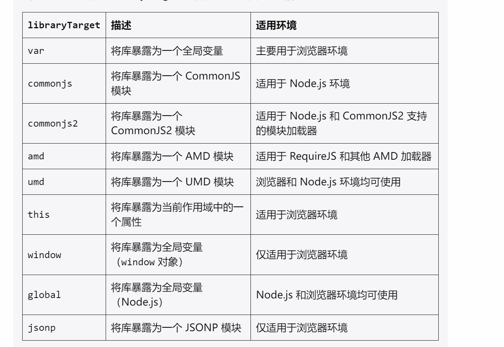

# libraryTarget(commonjs2)

# 创建 webpack.config.js 配置文件

```
const path = require('path');

module.exports = {
  entry: './index.js', // 入口文件
  output: {
    filename: 'bundle.js',  // 输出文件名
    path: path.resolve(__dirname, 'dist'), // 输出路径
    libraryTarget: 'commonjs2' // 输出格式
  },
  mode: 'development', // 或 'production'
};
```

# 使用

在 package.json 中添加 scripts

```json
"scripts": {
    "build": "webpack"
}
```

然后运行`npm run build`,此时会报错

因为我们需要安装 webpack-cli

# 测试

```
module.exports = (context) => {
  console.log("hello world:", JSON.stringify(context))
}
```

这里测试的是一个 nodejs 模块，打包后我们可以在 nodejs 中测试

```
// test.js
const myModule = require('./dist/bundle.js');

// 调用模块并传入上下文对象
myModule({ key: 'value' });
```

```
node test.js
```
