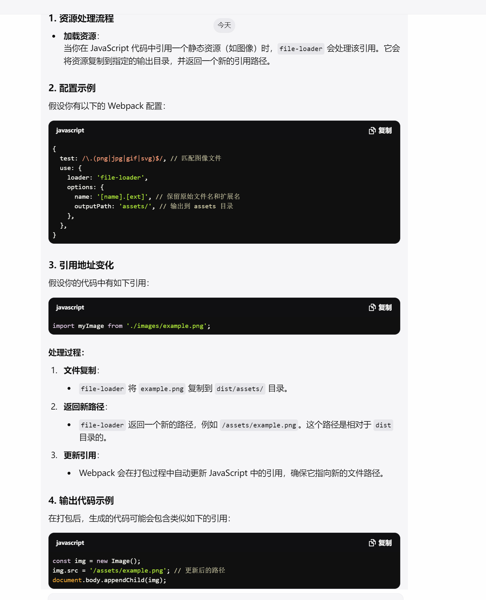

# loader

webpack 只能理解 javascript 和 json 文件，这是 webpack 开箱可用的自带能力。
如果需要加载其他类型的文件，需要使用 loader
loader 让 webpack 能够去处理其他类型的文件，并将它们转换为有效 模块，以供应用程序使用，以及被添加到依赖图中。

在更高层面，在 webpack 的配置中，loader 有两个属性：

1. test 属性，识别出哪些文件会被转换。
2. use 属性，定义出在进行转换时，应该使用哪个 loader。

## file-loader

file-loader 可以把文件输出到一个文件夹中，在代码中通过相对 URL 去引用输出的文件。

```js
module.exports = {
  module: {
    rules: [
      {
        test: /\.(png|jpe?g|gif)$/i,
        use: [
          {
            loader: "file-loader",
          },
        ],
      },
    ],
  },
};
```

```
module.exports = {
  module: {
    rules: [
      {
        test: /\.(png|jpe?g|gif)$/i,
        loader: 'file-loader',
        options: {
          name(resourcePath, resourceQuery) {
            // `resourcePath` - `/absolute/path/to/file.js`
            // `resourceQuery` - `?foo=bar`

            if (process.env.NODE_ENV === 'development') {
              return '[path][name].[ext]';
            }

            return '[contenthash].[ext]';
          },
        },
      },
    ],
  },
};
```

### 占位符

- [name]: 代表原始文件的名称（不包括扩展名）。例如，如果你的文件是 example.png，那么 [name] 将替换为 example。
- [ext]: 代表原始文件的扩展名，包括前面的点（.）。例如，如果你的文件是 example.png，那么 [ext] 将替换为 png。
- [path]: 代表文件的相对路径，从 context（通常是项目的根目录）开始。例如，如果你的文件位于 src/images/example.png，那么 [path] 将替换为 src/images/。
- [folder]: 代表文件的文件夹名称。例如，如果你的文件位于 src/images/example.png，那么 [folder] 将替换为 images。
- [hash]: 代表文件的哈希值。例如，如果你的文件是 example.png，那么 [hash] 将替换为一个唯一的哈希值，例如 1234567890abcdef。
- [contenthash]: 代表文件内容的哈希值。例如，如果你的文件是 example.png，那么 [contenthash] 将替换为文件内容的哈希值，例如 1234567890abcdef。
- [emoji]: 代表一个随机的 Unicode 表情符号。例如，[emoji] 将替换为一个随机的 Unicode 表情符号，例如 😊。
- [query]: 代表文件的查询参数。例如，如果你的文件是 example.png?foo=bar，那么 [query] 将替换为 foo=bar。
- [segment]: 代表文件的路径段。例如，如果你的文件位于 src/images/example.png，那么 [segment] 将替换为 images/example.png。
- [custom]: 代表一个自定义的占位符。例如，你可以使用 [custom] 来替换为自定义的值。

### 资源路径处理

在使用 file-loader 时，打包后的代码会自动处理静态资源的引用地址，以确保在浏览器中正确加载这些资源。以下是具体的处理过程：


#### 总结

1. 自动处理：file-loader 会自动将静态资源复制到指定目录，并返回新的引用路径。
2. 正确引用：Webpack 会在打包时更新代码中的资源引用，确保它们正确指向输出的文件。

## 注意

- `file-loader` 会把文件复制到输出目录，并返回相对路径。
- `url-loader` 功能类似于 `file-loader`，但是在文件大小（单位 byte）低于设定的 limit 值时，可以返回一个 DataURL。

## url-loader

url-loader 功能类似于 file-loader，但是在文件大小（单位 byte）低于设定的 limit 值时，可以返回一个 DataURL。

```js
module.exports = {
  module: {
    rules: [
      {
        test: /\.(png|jpe?g|gif)$/i,
        use: [
          {
            loader: "url-loader",
            options: {
              limit: 8192,
            },
          },
        ],
      },
    ],
  },
};
```

## css-loader

css-loader 解析 @import 和 url()，会 import/require() 后再解析。

```js
module.exports = {
  module: {
    rules: [
      {
        test: /\.css$/,
        use: ["style-loader", "css-loader"],
      },
    ],
  },
};
```

## style-loader

style-loader 将 css-loader 的结果注入到 JavaScript 的 `<style>` 标签中。

```js
module.exports = {
  module: {
    rules: [
      {
        test: /\.css$/,
        use: ["style-loader", "css-loader"],
      },
    ],
  },
};
```

## sass-loader

sass-loader 加载并编译 Sass/SCSS 文件。

```js
module.exports = {
  module: {
    rules: [
      {
        test: /\.s[ac]ss$/i,
        use: ["style-loader", "css-loader", "sass-loader"],
      },
    ],
  },
};
```

## babel-loader

babel-loader 使用 babel 编译 js 文件。

```js
module.exports = {
  module: {
    rules: [
      {
        test: /\.js$/,
        exclude: /node_modules/,
        use: {
          loader: "babel-loader",
          options: {
            presets: ["@babel/preset-env"],
          },
        },
      },
    ],
  },
};
```

## ts-loader

ts-loader 加载并编译 ts 文件。

```js
module.exports = {
  module: {
    rules: [
      {
        test: /\.tsx?$/,
        use: "ts-loader",
        exclude: /node_modules/,
      },
    ],
  },
};
```

## vue-loader

vue-loader 加载并编译 vue 文件。

```js
module.exports = {
  module: {
    rules: [
      {
        test: /\.vue$/,
        loader: "vue-loader",
      },
    ],
  },
};
```
